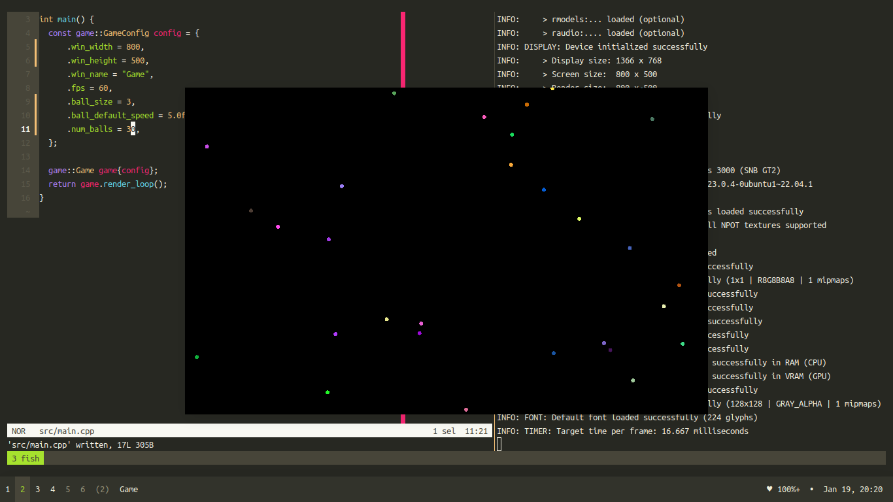

# linear-trajectory
A simple visualization of n number of balls bouncing around the screen following a linear trajectory. The graphics are built using `raylib`.




## Building application
```bash
$ make build
```

**Note**: `clang`, `make`, `bear` and `raylib` are required for building this application.


### Running application
```bash
$ make run
```
